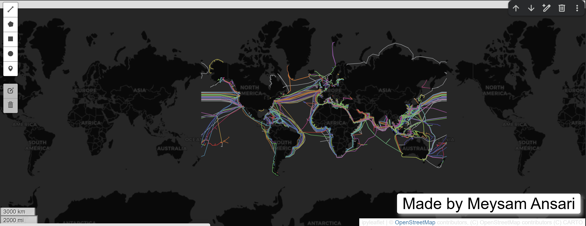

# Spatial-data-management-gee
Spatial Data Management with Google Earth Engine
# Lab 1 – Interactive Mapping with Leafmap

Spatial Data Management with Google Earth Engine  
Tool: Google Colab + Leafmap  

Objective
Creating an interactive global map using the `leafmap` Python package, customizing basemaps, adding vector data, and annotating the map with text and a logo.

Output
Below is a screenshot of the generated interactive map:

Notebook
The full executable notebook is available here:
- `LeafMapy.ipynb`

Notes
- The notebook was developed and executed in Google Colab.
